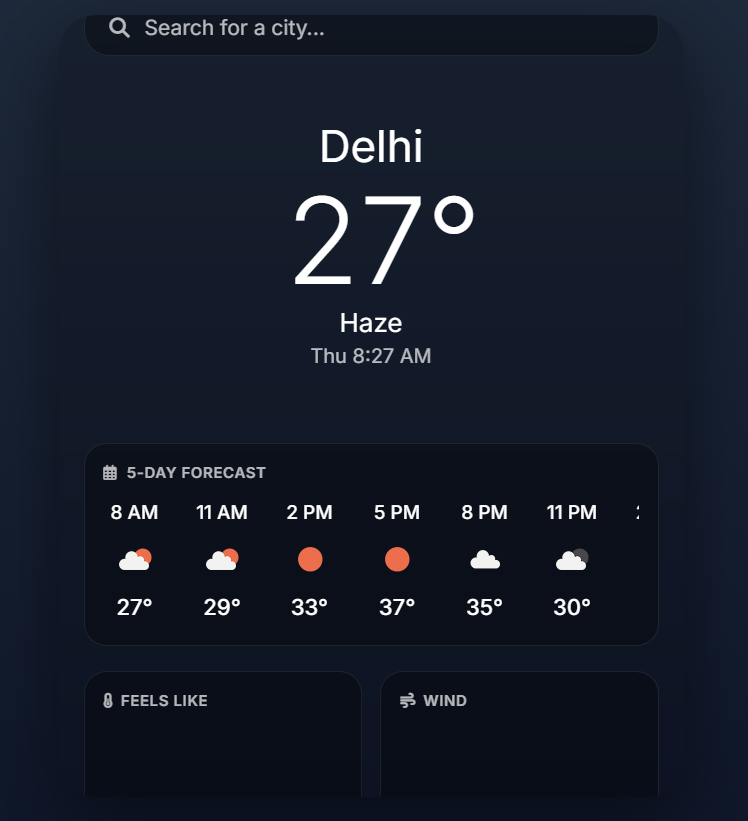
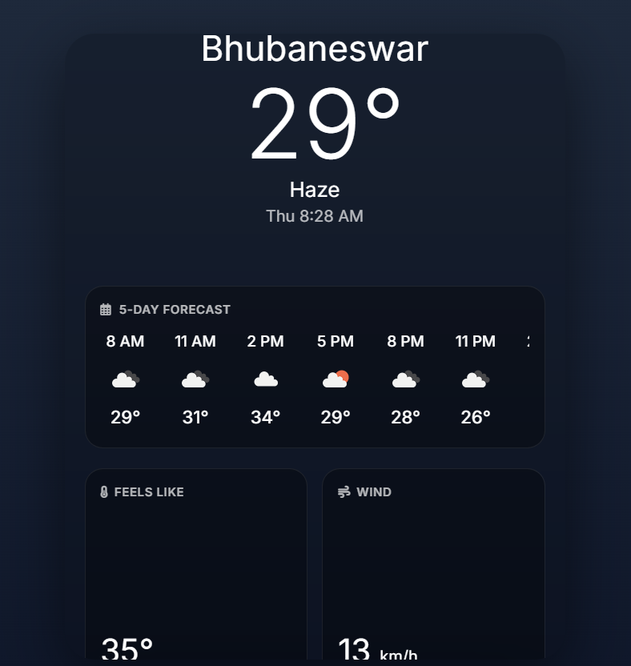
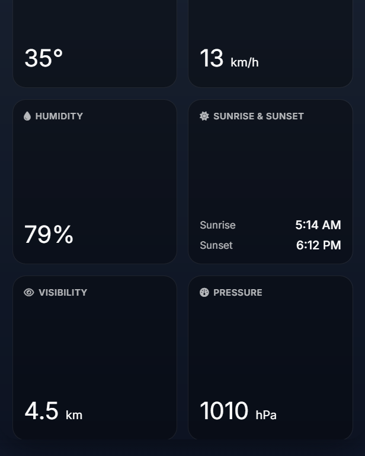

# SkyCast — Modern Weather Dashboard

SkyCast is a modern responsive weather dashboard that provides real-time weather information using the OpenWeather API.

## Features

- Real-time weather data
- Responsive mobile-friendly design
- Hourly weather forecast
- Dynamic weather conditions
- Modern UI dashboard
- Fast city-based search

## Technologies Used

- HTML
- CSS
- JavaScript
- OpenWeather API

## Screenshots

### Desktop View

### City Weather View

### Weather Details Panel

## Author

Parag Mohapatra